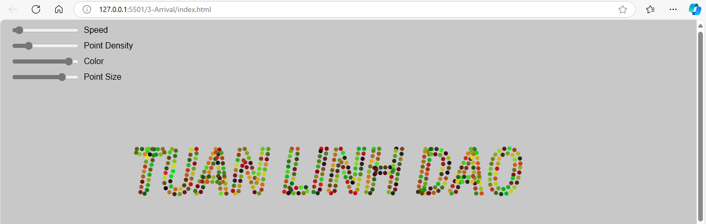

# Steering-behaviors

## 1. Prérequis 

- [Node.js et npm](https://nodejs.org) (pour installer et gérer les packages si nécessaire)
- Un navigateur compatible avec JavaScript
- Live Server installé dans VSCode

## 2. Cloner le dépôt par la commande

```bash
git clone https://github.com/Linhkobe/Steering-behaviors.git 
```
## 3. Accès dans les dossiers du dépôt

Ensuite pour accéder à l'un de dossier dans le dépôt (de "1-Seek" jusqu'à "8-EvolutionarySteeringBehavior"), utilisez la commande par exemple:

```bash
cd "1-Seek"
```
## 4. Lancer le projet en général

Cliquez simplement le fichier "index.html" dans le dossier lequel vous préférez, cliquez droit et choissisez "Open with Live Server/ Ouvez avec Live Server" dans la liste et le canvas sera lancé dans votre navigateur. 

## 5. Détail des dossiers 

### 5.1 Seek  

Implémentation d'un comportement de steering simple en utilisant P5.js. Un véhicule virtuel suit une cible dans le canvas, avec des contrôles pour ajuster la vitesse et la force de déplacement en utilisant deux sliders.


### 5.2 PursueEvade 

#### Implémentation d'une simulation complexe où plusieurs véhicules poursuivent des cibles tout en interagissant avec des balles rebondissantes, offrant ainsi une démonstration visuelle de comportements de poursuite et d'évasion.

Description des éléments dans le canvas :
- Poursuivants (pursuers) : représentés par des triangles, les poursuivants essaient de suivre des balles rebondissantes qui passent dans leur champ de vision.

- Cibles (targets) : représentées par des cercles colorés, les cibles se déplacent aléatoirement dans le canvas, ajoutant un défi supplémentaire pour les poursuivants.

- Balles rebondissantes (Bouncing Balls) : dispersées dans le canvas avec des vitesses aléatoires, elles rebondissent contre les bords du canvas et représentent les cibles que les poursuivants doivent poursuivre.

Contrôles interactifs (Sliders) :
- Les paramètres peuvent être ajustés à l'aide de curseurs pour modifier le comportement des entités en temps réel :

+ Max Speed (Vitesse maximale) : contrôle la vitesse maximale des poursuivants. Plus la valeur est élevée, plus les poursuivants peuvent se déplacer rapidement.

+ Max Force (Force maximale) : ajuste la force maximale appliquée aux poursuivants pour atteindre les cibles. Cela influe sur leur maniabilité et leur capacité à changer de direction.

+ "Prediction Frames" (Cadre de prédiction) : modifie la précision avec laquelle les poursuivants prédisent la position future des balles. Une valeur plus élevée leur permet d’anticiper les mouvements, améliorant leur efficacité.

+ "Target Max Speed" (Vitesse maximale des cibles) : ajuste la vitesse maximale des cibles. Cela peut rendre les cibles plus difficiles à suivre pour les poursuivants.

+ "Target Max Force" (Force maximale des cibles) : contrôle la force maximale des cibles, influençant leur capacité à éviter les poursuivants.

+ "Field of Vision" (Champ de vision) : détermine la distance à laquelle un poursuivant peut détecter et cibler une balle. Un champ de vision plus large signifie que les poursuivants peuvent repérer les cibles plus facilement.

+ "Number of Pursuers" (Nombre de poursuivants) : permet de choisir le nombre de poursuivants dans la scène. En augmentant ce nombre, l'utilisateur peut observer comment les poursuivants interagissent en groupe pour suivre les cibles.

+ "Number of Balls" (Nombre de balles) : ajuste le nombre de balles rebondissantes dans le canvas, ajoutant des cibles supplémentaires pour les poursuivants.


### 5.3 Arrival

Description de l'animation sur le canvas: 

Dans cette animation, le texte est représenté sous forme de points sur le canvas, chaque point agissant comme un petit "véhicule" qui se déplace pour former un mot ou une phrase prédéfinis. Ces véhicules adoptent des comportements de regroupement pour créer un effet de texte visuel attrayant, où chaque véhicule ajuste son mouvement pour atteindre sa position cible tout en maintenant l'alignement, la cohésion et la séparation avec les autres véhicules.

Le texte affiché peut être personnalisé, et l'animation se met à jour dynamiquement à mesure que différents paramètres (comme la vitesse, la couleur et la densité des points) sont ajustés via des curseurs.

#### Les cursuers interactifs: 

+ Densité des points (Point Density): permettre d'ajuster la densité des points qui représentent le texte. Plus évelée la densité, plus lisse/ plus complet le texte. 

+ Vistesse (Speed): permettre de contrôler la vitesse de chaque véhicule (chaque point).

+ Couleur (Color): permettre d'ajuster la couleur des véhicules ou des points.

+ Taille des points (Point Size): contrôler la taille de chaque point représentent le texte. 

#### Interaction lorsqu'on teste le canvas:

+ Saisie du texte: on peut changer le texte affiché sur le canvas en appuyant sur la touche "d", ce qui ouvre une boître de dialogue pour entrer un nouveau texte préféré, le texte saisi sera automatiquement mis à jour et affiché dans le canvas. 

+ Le comportement des points: chaque véhicule se déplace vers sa position cible en utilisant les comportements tels que l'alignement, la cohésion pour créer un effet de texte animé et fluide. 



### 5.4 Wander

#### Description de canvas: chaque véhicule est présenté comme un triangle coloré et orienté dans la direction de son mouvement. Les véhicules ont un comportement autonome et suivent des trajectoires basées sur des forces simulées. Les véhicules affichent également un chemin qui montre leur trajectoireprécédente sous forme de petits points. 

#### Les sliders: 

+ "Distance du Centre du cercle": distance entre le véhicule et le centre du cercle autour duquel il erre. 

+ "Rayon du Cercle": le rayon de cercle d'errance.

+ "Variation de l'Angle Theta": l'angle qui change aléatoirement pour modifier la direction d'errance. 

+ "Vitesse Max": permettre de contrôler la vitesse de chaque véhicule.

+ "Force Max": contrôle la force maximale des cibles.

+ "Nombre de véhicules": le nombre de véhicule dans le canvas.

#### L'action de souris: en cliquant sur le canvas, on peut ajouter un nouveau véhicule à l'emplacement du curseur. 


### 5.5 PathFollowing 

#### Description de canvas: 

- Un chemin en sorte d'un circuit composé de plusieurs points, représenté par une ligne, guide le déplacement des véhicules. 

- Chaque véhicule a un comportement "Wander" et suit le chemin. Les véhicules se déplacent avec des couleurs différentes: 
    + verts pour les véhicules errants
    + rouges pour les véhicules rapides (on peut les ajouter en appuyant sur la touche "R" ou "r") 
    + blancs pour les véhicules ajouté en cliquant la souris. 

- Curseurs interactifs: 

    + Vistesse du Véhicule: contrôler la vitesse maximales des véhicules.
    + Rayon du Chemin: ajuster la largeur du chemin que le véhicule doivent suivre.
    + Poids de séparation: déterminer le niveau d'évitement entre les véhicules, pour les garder à distance les uns des autres.
    + Poids d'Alignement: modifier la tendance des véhicules à s'aligner les uns avec les autres. 

- Les autres actions lorsqu'on teste le canvas: 

    + Clic de la souris: ajouter un nouveau véhicule en blanc à la position du curseur de la souris. 
    + Les touches "R" ou "r": ajouter un véhicule en rouge rapide, avec une vitesse plus élevée que les autres véhicules.

